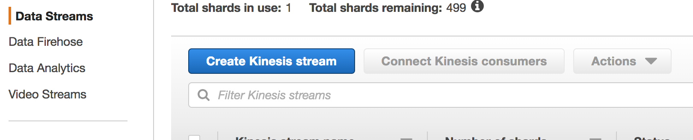

# **Lab 2 - Stream Data with Kinesis**

In this Lab, we will setup setup a Lambda function to push user rating data into Kinesis data stream and then use Amazon Kinesis Firehose to export data to S3. The Lambda function will simulate user generated real time ratings data. Amazon Kinesis makes it easy to collect, process, and analyze real-time, streaming data so you can get timely insights and react quickly to new information. By using Kinesis, we can store real time data data update our machine learning model. Kinesis supports multiple consumers for its data streams so another consumer can be setup to process data and store it into DynamoDB.

## 1. Create an Amazon Kinesis stream

   1. Sign into the AWS management console.
   2. In the upper right hand of the console make sure you are in the desired region (eg: N Virginia)
   3. Click on kinesis from the list of services. You will arrive on the kinesis dashboard.
   4. On the Kinesis Dashboard, click **Data Stream** on the left panel and then click **Create** **Kinesis Stream**. If you do not see the panel but a welcome page, go ahead and click “**Get Started**”.
    
   5. For Kinesis stream name, enter YourInitials_stream. Enter 1 for Number of Shards. 	
   6. Click on create streams. The stream will be on creating status. Wait for stream to be in **ACTIVE** status.

## 2. Create an Amazon Kinesis Firehose stream

   1. Sign into the AWS management console.
   2. In the upper right hand of the console make sure you are in the desired region (eg: N Virginia)
   3. Click on kinesis from the list of services. You will arrive on the kinesis dashboard.
   4. On the Kinesis Dashboard, click **Data Stream** on the left panel and then click **Create** **Kinesis Firehose Stream**. If you do not see the panel but a welcome page, go ahead and click “**Get Started**”.
     
   5.	For Delivery stream name, enter YourInitials_firehosestream. In the Source option field, choose Kinesis stream and in the Kinesis stream drop down, select the stream created in previous section. Click Next
   6. In the Tranform records page, choose Disabled. Note that Amazon Kinesis Firehose provides the capability through Lambda to transform the source data before loading them into the destination datasource. 
   7. Click Next.
   8. Choose Amazon S3 as the Destination. Click Create New to create a new S3 bucket with the name YourInitials-firehose-bucket in lower case, other wise you will receive an error. In the Prefix field, enter raw.  
   9. Keep default setting by clicking next on the following 2 pages and choose **Create delivery stream**

##  3. Create Lambda function to load data into stream

1. Sign into the AWS management console.
2. In the upper-right corner of the AWS Management Console, confirm you are in the desired AWS region (e.g., N. Virginia).
3. Click on IAM from the list of all services. This will bring you to the IAM dashboard page.
4. Click Roles on the left hand panel and then click Create role.
5. Select **Lambda**
6. Click Next: Permissions.
7. In attach permission policies page, search for Kinesis and select AmazonKinesisFullAccess and AWSLambdaKinesisExecutionRole.
8. Click Next: Review 
9. Enter YourInitials_kinesis_lambda for the Role Name and click Create Role.
10. Go back to AWS Management Console https://console.aws.amazon.com/
11. In the upper-right corner of the AWS Management Console, confirm you are in the desired AWS region (e.g., N. Virginia).
12. Click on Lambda from the list of all services. This will bring you to the AWS Lambda dashboard page.
13. On the Lambda Dashboard, click Create Function
14. Select Author from scratch and enter the following
			
			-Name: YourInitials_simulator
			-Runtime: Python 3.6
			-Role: Choose an existing role
			-Exiting Role: YourInitials_kinesis_lambda
			
15. Click Create function
17.	In code editor, copy and paste the code under lambda folder of this project.
18. Leave everything on the page default except the Timeout value, change it from 3 seconds to 8 minutes
19. Click Save on the top right hand corner of the screen and then click Test. Since we are not providing any parameter or input values, leave everything default, give it a name **Test**, and click Create. 
20. The function will run 8 minutes to put rating data into the Kinesis stream. Note you may get a timeout error, this is normal as the function timed out (8 mins) before it could push all records. Continue to next step.
21. So far, we have a Kinesis stream and we have created the Lambda function to put ratings records into the stream. We also setup Kinesis Firehose to retrieve the data in the stream and store them in a S3 bucket. To verify everything is working, go to the S3 bucket and verify the data files exist. Note Kinesis Firehose stores data in a year/month/date folder.

# **Lab 3 - Create an AWS Glue Job**

In Lab2, you used Kinesis to collect and store real time ratings data into S3. In this Lab, you will use Glue Data Catalog to define schema on the data stored in S3 and DynamoDB. You will perform ETL on the data to prepare it for the machine learning process. The output data from Glue will be used at input to the Amazon Sagemaker notebook.

## 1. Populate the S3 Glue data catalog

1. The AWS Glue Data Catalog is an index to the location, schema, and runtime metrics of your data. It contains references to data that is used as sources and targets of your extract, transform, and load (ETL) jobs in AWS Glue. The Data Catalog is a drop-in replacement for the Apache Hive Meta-store and provides a uniform repository where disparate systems can store and find metadata to keep track of data, and use that metadata to query and transform the data. To populate the data catalog, we need to first create a role with proper permissions and then a crawler to take inventory of the data in our S3 bucket and Dynadb tables.

2.	Sign into the AWS Management Console https://console.aws.amazon.com/.
3.	In the upper-right corner of the AWS Management Console, confirm you are in the desired AWS region (e.g., N. Virginia).
4.	Click on IAM from the list of all services. This will bring you to the IAM dashboard page.
5.	Click Roles on the left hand panel and then click Create role.
6. Select Glue
7. Click Next: Permissions
8.	In attach permission policies page, add AWSGlueServiceRole, AWSGlueSErviceNotebookRole, AmazonDynamoDBFullAccess and AmazonS3FullAccess. 
9. Click Next:Review
10.	Name it YourInitialsGlueServiceRole and Click Create Role
11.	Go back to AWS Management Console https://console.aws.amazon.com/.
12.	In the upper-right corner of the AWS Management Console, confirm you are in the desired AWS region (e.g., N. Virginia).
13.	Click on Glue from the list of all services. This will bring you to the AWS Glue dashboard page.
14.	Click on Crawlers on the left panel and then click Add crawler 
15.	For Crawler name, enter YourInitials_S3_stream.
17.	Click Next 
18.	For Data store, ensure S3 is selected. Choose Specified path in my account and for Include path, enter s3://YourInitials-firehose-bucket/
19.	Click Next 
20.	Choose No to Add another data store
21.	Click Next
22.	Choose an existing IAM role and select YourInitialsGlueServiceRole in the drop down box
23.	Click Next
24.	For Frequency, choose Run on demand and click Next
25.	For Database, click Add database, name it YouInitials_bigdata, and click Create. 
26.	Click Next
27.	Review the configuration and click Finish.
28.	On the Crawlers page, tick the checkbox of the crawler just created and click Run crawler.
29.	Wait for the crawler to finish.
30.	Click Databases on the left panel and tick the checkbox next to YourInitials_bigdata database, then click View tables. 
31. Verify that your table is created from S3 data.

## 2. Populate the DynamoDB Glue data catalog

1.	Go back to AWS Management Console https://console.aws.amazon.com/.
2.	In the upper-right corner of the AWS Management Console, confirm you are in the desired AWS region (e.g., N. Virginia).
3.	Click on Glue from the list of all services. This will bring you to the AWS Glue dashboard page.
4.	Click on Crawlers on the left panel and then click Add crawler 
5.	For Crawler name, enter YourInitials_Dynamodb_stream.
7.	Click Next 
8.	For Data store, ensure DynamoDB is selected. Choose movies_t table and click next.
9.	Click Next 
10. Choose Yes to Add another data store
11. For Data store, ensure DynamoDB is selected. Choose links_t table and click next.
12.	Choose Yes to Add another data store
13. For Data store, ensure DynamoDB is selected. Choose ratings_t table and click next.
14.	Click Next
15. Choose No to Add another data store
16.	Choose an existing IAM role and select YourInitialsGlueServiceRole in the drop down box
17.	Click Next
18.	For Frequency, choose Run on demand and click Next
19.	For Database, click choose existing database created in above session YouInitials_bigdata, and click Create. 
20.	Click Next
21.	Review the configuration and click Finish.
22.	On the Crawlers page, tick the checkbox of the crawler just created and click Run crawler.
22.	Wait for the crawler to finish.
23.	Click Databases on the left panel and tick the checkbox next to YourInitials_bigdata database, then click View tables. 
24. Verify that 3 tables are created which store information about data in DynamoDB.

## 3. Transform data from Glue

1.	Sign into the AWS Management Console https://console.aws.amazon.com/.
2.	In the upper-right corner of the AWS Management Console, confirm you are in the desired AWS region (e.g., N. Virginia).
3.	Click on Glue from the list of all services. This will bring you to the AWS Glue dashboard page.
4.	Click on Jobs on the left panel.
5.	Close the Add a job dialog box with instructions by clicking the “X” button in the upper right of the dialog.
6. Click Add job.
8.	Close the Specify job properties dialog box with instructions by clicking the “X” button in the upper right of the dialog.
9.	In Job properties page, enter the following
			
			Name: YourInitials_bigdata_analytic_csv2parquet
			IAM role: YouInitialsGlueServiceRole
			The job runs: A new script to be authored by you
			ETL Language: Python
			Script file name: YourInitials_datalake_ml
			S3 path where the script is stored: 
			Expand Script libraries and job parameters section and change Concurrent DPUs per job run from 10 to 100. This will help speed up the transformation process.
			Leave everything else default

10.	Click Next
11.	Skip output table selection and click Next.
12. In the script page copy the script under folder glue of this project and paste it in the editor.
13. Click on RunJob and take a break. This Job can take about 10-15 mins to complete when Glue launches the cluster for the first time.
14. Once the Job is complete verify that Glue has 3 output directories for your machine learning job.
15. 

    

